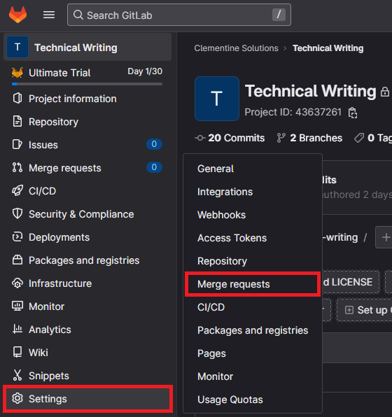
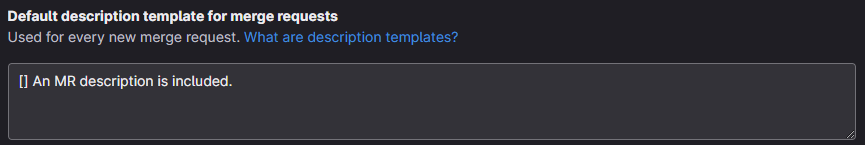
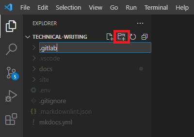
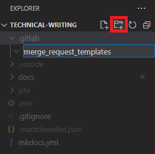
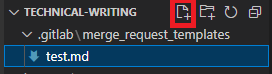
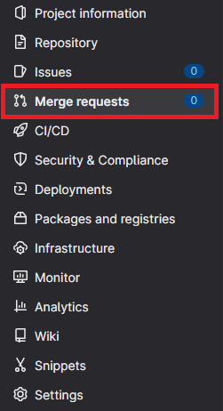
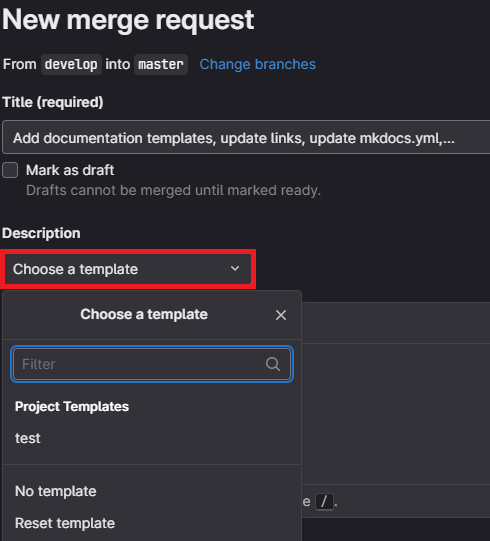
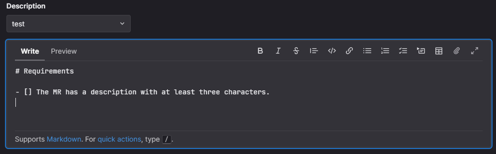

# Follow a Docs-as-Code Strategy

This topic explains how to bundle project and documentation development using the same Tools-as-Code for authoring, versioning, and publishing content. This methodology is called Docs-as-Code.

For external developers and clients, the documentation is the project. It’s equally important to teach users how to use the project as it is to develop it. This means integrating your documentation into your repositories, requiring documentation for all new features, and reviewing that documentation before any merge requests can be approved.

## Why use Docs-as-Code?

The best way to guarantee project efficiency is to ensure all code changes are being properly documented at the time of release while your knowledge is still fresh. Docs-as-Code is a broader concept than just that — it also includes improving the ways of working between developers and documentation writers.

## Use workflow management tools to scale

Use tools like [Jira](https://www.atlassian.com/software/jira) and [GitLab](https://gitlab.com/) to tie development with documentation and create safeguards to ensure that all feature changes are considered for documentation.

### Jira workflow

Use your best judgment to determine which tickets need new documentation. New features and significant code changes require supporting documentation, while minor bug fixes may *not* warrant a documentation change.

Be mindful that it's much easier to document something as it's happening rather than trying to document it weeks or months later.

Most documentation should be written in Markdown, in the same repository as the main project. All other documentation — such as high-level architecture and collaborative information meant for an internal audience, can be written in an appropriate place in [Confluence](https://www.atlassian.com/software/confluence).

This process encourages developers to think more proactively and ensures that any produced documentation is added to Jira. This creates easier access for anyone looking for documentation in a Jira ticket after completion.

### GitLab merge request checks

Use checklists to monitor merge requests and ensure new features or code changes have applicable documentation if necessary. If a user tries to merge without addressing documentation, you can reject their MR until they do.

These checklists have broader use and can be used for testing purposes or anything else in your project that should be tracked for each merge request. Checklists automatically populate in merge requests to ensure each request follows proper protocols.

Here's a simple MR checklist for inspiration:

- An MR description is included.
- Code changes have been tested.
- Added the applicable documentation.

There are two ways to add a merge request checklist to GitLab: through the GitLab UI or by using Markdown files.

#### GitLab UI

Follow these steps to enable MR checks through the GitLab UI.

1. Navigate to your repository in GitLab, hover over **Settings**, and click **Merge requests**:

    

1. Enter your checklist in the **Default description template for merge requests** field:

    

    You can add typical Markdown formatting in this box by using square brackets (`[ ]`) to show a checkbox in the checklist.

#### Markdown files

Follow these steps to enable MR checks with Markdown files:

1. In the root directory of your repository, create a new directory called `.gitlab`:

    

2. In the `.gitlab` directory, create a new directory called `merge_request_templates`:

    

3. Add Markdown files into the `merge_request_templates` directory:

    

4. Navigate to your repository in GitLab and click **Merge requests**.

    

5. Click **New merge request**.
6. Select a **Source branch** and a **Target branch**.
7. Select the **Choose a template** drop-down menu.

    

    The template populates in the MR description upon selection:

    

## Docs-as-Code and your team

You should now have a better view of how to document your project sustainably. These suggestions and guidelines are just that. Use what works best for your team. The most important thing to remember is to have a documentation strategy for your project — with a plan and a roadmap to execute. The sooner you introduce documentation into your development process, the easier it will be to maintain.

## Next step

- [Write your documentation](write-docs.md)
