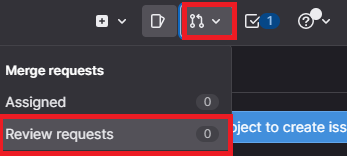
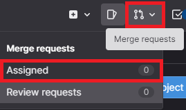
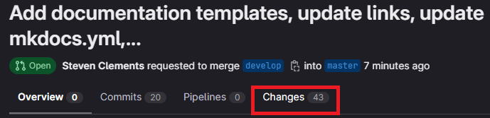
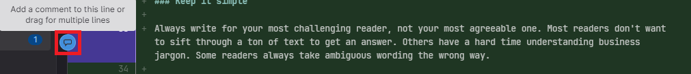
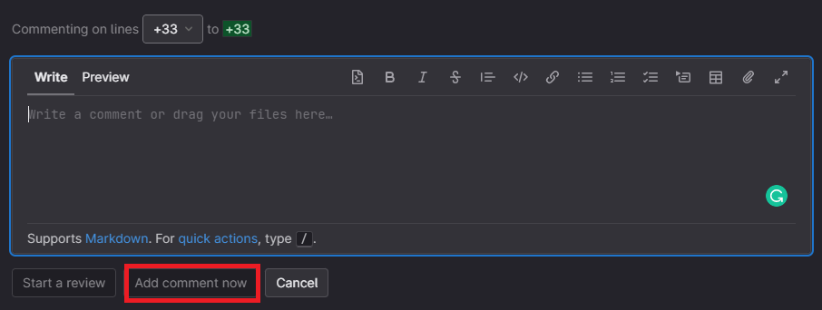
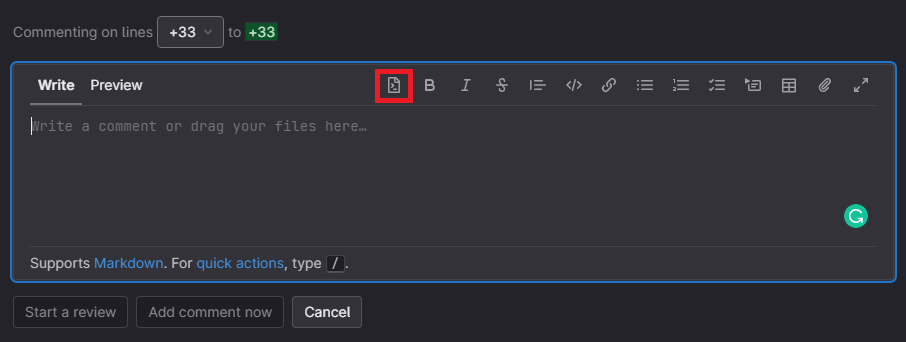

# Documentation reviews

Consistent, thorough, and accurate reviews are essential to writing good documentation. Documentation reviews are the final step (and one of the most important) of the publication process.

Use your [Docs-as-Code](docs-as-code.md) process to plan a review protocol for your docs. Consider these as a starting point:

- Set up a peer-review cycle with your team or clients.
- Review the content with subject-matter experts (SMEs).
- Use tools to help you review your content.
- Test content with your users.
- Perform scheduled content audits.

## Review other writer's docs

When you review docs for other members of your team (or other writers), you should understand the difference between *proofreading* and *providing feedback*.

- *Proofreading* is performed to evaluate a text for correctness and mechanical accuracy. This includes evaluating a text's grammar, spelling, [Word choices](../style-guide/language-choices.md), word omissions, formatting, spacing, punctuation, consistency, and other errors.
- *Feedback is provided* to evaluate the overall effectiveness of the text's content — for instance, to offer feedback on how well the writer used structure to convey the information to their users.

Both tools are beneficial for your writing. However, they should be used in the appropriate circumstances. Docs that are mechanically accurate and well-written, but lack the proper structure to address user needs, would benefit from editorial feedback to address these shortcomings. Docs that contain typographical errors, but convey information effectively, may only need proofreading for clarity and accuracy. In any case, both methods should be used for a complete and effective review of a text.

Consider a hierarchical approach when reviewing documentation — address the structural issues and technical accuracy with feedback before addressing typographical errors through proofreading.

### Review tools

There are several tools you can use to review content quickly and effectively:

- **GitLab repo merge requests and reviews**: Use the comments and suggestions feature to easily provide feedback and proofread docs.
- [Grammarly](https://app.grammarly.com/): An online tool and resource for quickly checking grammar and other typographical errors.
- [MarkdownPad](http://www.markdownpad.com/): A tool to help edit, review, and convert Markdown files. Use MarkdownPad to diagnose any errors present in Markdown code that may cause document rendering issues.
- **Collaboration tools**:
    - Google Docs
    - Microsoft 365
    - Dropbox Paper
    - Jupyter Notebook

### Review GitLab merge requests

Use the merge request *comment* feature to review docs in your web browser.

To submit a review to a GitLab merge request:

1. Go to the merge request that needs to be reviewed.
    - In GitLab, find merge requests assigned to you for review by clicking the **merge request** icon in the top-right corner of the screen, and click **Review requests**:

        

    - You can also see merge requests assigned to you by clicking **Assigned to you** from the merge request drop-down menu.

        

2. Select the **Changes** tab:

    

    The latest version of the text displays by default. If the text doesn't display the latest version, click **Show latest version**.

3. Hover your cursor over a code line and click **comment** from the left side of the code line to leave a comment or suggestion:

    

    - To leave a comment, write the comment in the displayed text box and click **Add comment now**:

        

    - To leave a suggestion, click the **suggestion** button and edit the line. Click **Add comment now** once you're finished:

        

> **Quick Tip**: Click **Start a review** instead of **Add comment now** to add comments and/or suggestions without immediately submitting them to the merge request assignee. When you're finished reviewing, click **Submit** to add all comments and/or suggestions and notify the merge request assignee that the review is complete.

## Review content with clients and SMEs

Review your documentation with clients and SMEs to make sure your documentation is useful and accurate.

1. Identify the right reviewers. These reviewers may be project leads, bar raisers, or SMEs who can verify technical details.
2. Ask them for specific feedback:
    1. What else should the reader know about the topic?
    2. Are the step-by-step instructions clear?
    3. Is it technically accurate?
3. Give them a deadline, and send out a reminder email if missed.
4. Integrate their feedback and, if reviewers are willing, have them take another look at the docs.
5. Perform usability testing. Find a developer unfamiliar with the content and shadow them through your documentation. Can they successfully use your documentation to achieve their goals? What pain points are still there?
6. Integrate final feedback.

After implementing feedback from your initial review session(s) with clients and SMEs, do a final review. Follow the same steps outlined above and ask previous reviewers to pay attention to your changes based on their feedback. You can also ask other people who have not looked at your documentation for a fresh perspective on what you've done.

## Next step

- [Test your docs](test-docs.md)
